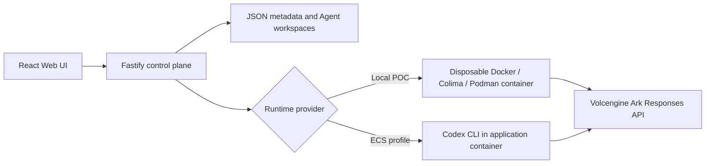

# Volc Agent Launchpad

## Coordination for agent teams

### The problem

When several coding agents work on the same codebase at once, nothing keeps them
out of each other's way:
As such, agents typically work in separate worktrees as there is no mechanism to coordinate concurrent changes or prevent overlapping work.
Some persisting issues include:
- Two agents edit the same file, and one change may overwrite the other or produce a merge conflict. Git can detect some textual write conflicts, but it does not prevent an agent from committing based on an outdated version.
- The backend changes an endpoint’s response shape while the frontend continues building against the old contract. Because the agents may modify different files—or even work in different repositories—Git sees no conflict, even though the resulting code is incompatible. The server fixes this by recording every file an agent reads and rejecting the commit if any of those files changed before the commit.
- An agent may die or fail midway through a task, leaving dependent work blocked indefinitely. The server fixes this by tracking task state, retrying failed tasks, and dropping a task after three unsuccessful attempts so that the queue can continue or the failure can be surfaced explicitly.

Git helps identify overlapping changes, but it does not provide coordination, dependency tracking, stale-read detection, or recovery from failed agents.

### The idea and design

This solution enables agents to collaborate by creating and assigning tasks to one another, much like a developer would create tasks for another developer. 

Agents can break work into smaller tasks, delegate dependent or parallel work, and communicate through a task server. The server coordinates task execution and controls all changes to shared state. It is a deterministic and testable server, not an LLM, consisting of a task queue and a versioned file store.

Agents' work is committed through the server and validated with read and write
versioning at commit time:

- an agent fetches the files it needs, works in its own scratch space, then
commits
- rejected if a file it **wrote** has changed since the version it based on
- rejected if a file it **read** has changed since it read it
- a rejection names the exact paths and versions, so the agent refetches and
retries
- after three failed attempts the task is dropped

The read check is the one that earns its keep. An agent can write a file nobody
else touched and still be rejected, because something it depended on moved.

Two rules make that possible:

- **one writer**: every change goes through a single serialized path in one
process, so there are no concurrent write problems to solve
- **empty workspace**: shared files are not on disk in the container, so the only  
way to read one is to ask the server, which is how the read gets recorded

### The rest of it

- tasks declare an owner, their dependencies, and the paths they intend to write
- a task is dispatched when its dependencies are done, its owner is idle, and its
writes do not overlap a task already running
- agents reach the server through a small command line tool in their workspace
- every decision is recorded as a numbered event, which is both the audit trail
and what the dashboard shows
- humans and agents come in through separate ports

### Limitations

Where this design stops:

- we only see reads that went through the server, so an agent still reasoning
from something it read earlier is beyond our reach
- we compare file paths, not meaning, so "this refactor breaks every caller" is
not something we can express
- one server, so if it stops, everything stops
- a task that fails three times is dropped, there is no freeze and no human
resolution step
- no agent heartbeats, so an agent that dies is not detected, its task just
never comes back
- no per repo permissions, an agent is trusted to stay in its own paths
- a retried container can commit twice, we do not deduplicate messages
- repos are versioned files in the store rather than real git

---

A minimal Agent platform for three-day middleware hackathons. It provides Agent
CRUD, a browser Playground, persistent workspaces, and Codex CLI backed by the
Volcengine Ark Responses API.

Run it locally with Docker, Colima, or rootless Podman, or deploy it to
Volcengine ECS.

> [!WARNING]
> This is a single-user proof of concept. It intentionally has no identity,
> tracing, audit, or hardened sandbox middleware. Do not use production data or
> credentials. See [SECURITY.md](SECURITY.md).

## Screenshots

### Agent Playground


### Create an Agent


## Features

- React and TypeScript Web UI
- Agent create, edit, start, stop, delete, and multi-turn chat
- Fastify control plane with asynchronous Run state
- Persistent Agent workspaces and Codex sessions
- Disposable Docker, Colima, or Podman container for each local turn
- Docker and Terraform deployment paths for Volcengine ECS

## Requirements

- Node.js 22+
- npm 10+
- Docker, Colima, or Podman
- A Volcengine Ark API key and endpoint that supports the Responses API

Codex CLI is included in the Runtime image and is not required on the host.

## Local browser SOP

### 1. Check the local tools

Install Node.js 22+ and one supported container engine, then verify them:

```bash
node --version
npm --version
docker --version        # Docker Desktop, Docker Engine, or Colima
podman --version        # Use this instead when running Podman
```

Only one container engine is required. Codex CLI is already included in the
Runtime image.

### 2. Clone the repository

```bash
git clone <repository-url> volc-agent-launchpad
cd volc-agent-launchpad
```

Skip this step when already working from the repository root.

### 3. Start the POC

```bash
ARK_API_KEY=your-ark-api-key \
ARK_MODEL=ep-your-endpoint-id \
npm run poc
```

The first run installs Node.js dependencies and builds the Runtime image. The
script automatically selects Docker, Colima, or Podman.

### 4. Open the browser

Visit <http://localhost:3000>, or open it from the terminal:

```bash
open http://localhost:3000       # macOS
xdg-open http://localhost:3000   # Linux desktop
```

In the Web UI:

1. Select **Create Agent**.
2. Enter a name, description, and workspace instructions.
3. Select **Create Agent** again.
4. Enter a task in the Playground, for example:

   ```text
   Create a TypeScript hello-world CLI, add a test, and run it.
   ```

The Agent can write files, run commands, and continue the same Codex session in
later messages.

### 5. Stop and resume

Press `Ctrl+C` in the startup terminal. The script removes temporary Runtime
containers but keeps Agent workspaces and conversations.

- macOS state: `~/.volc-agent-launchpad/`
- Linux state: `.local/`
- Custom location: set `LOCAL_POC_DATA_ROOT`

Run the same `npm run poc` command to continue later.

### Select a specific container engine

Force Podman when multiple engines are installed:

```bash
CONTAINER_ENGINE=podman \
ARK_API_KEY=your-ark-api-key \
ARK_MODEL=ep-your-endpoint-id \
npm run poc
```

Colima uses `CONTAINER_ENGINE=docker` because it exposes the Docker CLI.

For a clean Linux host, follow the
[rootless Podman setup](docs/LOCAL_POC.md#rootless-podman-on-linux).

## Docker Compose

Create and edit the configuration:

```bash
./scripts/bootstrap-local.sh
```

Required values in `.env`:

```dotenv
ARK_API_KEY=your-ark-api-key
ARK_MODEL=ep-your-endpoint-id
APP_AUTH_TOKEN=replace-with-at-least-24-random-characters
```

Start the application:

```bash
docker compose up --build
```

Open <http://localhost:3000>. Stop it without deleting Agent data:

```bash
docker compose down
```

## Development

```bash
npm install
cp .env.example .env
npm install --global @openai/codex@0.111.0
npm run dev
```

- Web UI: <http://localhost:5173>
- API: <http://localhost:3000>

Use local paths in `.env` when running outside Docker:

```dotenv
APP_DATA_DIR=.data
AGENT_WORKSPACE_ROOT=workspaces
CODEX_HOME=codex-home
```

## Deployment

- [Existing Linux ECS with Docker](docs/DEPLOYMENT.md#existing-linux-ecs)
- [Complete Volcengine environment with Terraform](docs/DEPLOYMENT.md#terraform-deployment)
- [Local Docker, Colima, and Podman details](docs/LOCAL_POC.md)

The existing-ECS script deploys from the current source tree:

```bash
cp .env.example .env.production
./scripts/deploy-existing-ecs.sh .env.production
```

The Terraform path provisions VPC, subnet, security group, ECS, and EIP:

```bash
cp deploy/volcengine/terraform.tfvars.example \
  deploy/volcengine/terraform.tfvars
./scripts/deploy-volcengine.sh
```

## Configuration

| Variable | Default | Purpose |
| --- | --- | --- |
| `ARK_API_KEY` | Required | Ark model API key. |
| `ARK_MODEL` | Required | Responses-capable endpoint or model ID. |
| `ARK_BASE_URL` | Beijing v3 endpoint | Ark OpenAI-compatible API URL. |
| `APP_AUTH_TOKEN` | Empty on loopback | Shared demo token; use 24+ random characters remotely. |
| `RUNTIME_PROVIDER` | `local-process` | `container` for disposable local Runtime containers. |
| `CODEX_SANDBOX_MODE` | `workspace-write` | Codex inner sandbox mode. |
| `CODEX_TIMEOUT_MS` | `600000` | Maximum duration of one turn. |
| `LOCAL_POC_DATA_ROOT` | Platform-specific | Local metadata, workspace, and session directory. |

See [.env.example](.env.example) for all Runtime and resource-limit options.

## How it works



The first turn uses `codex exec`; later turns resume the stored Codex thread.
Deleting an Agent archives its workspace under `workspaces/.deleted/`.

See [docs/ARCHITECTURE.md](docs/ARCHITECTURE.md) for component and extension
boundaries.

## Validation

```bash
npm run check
terraform fmt -check -recursive deploy/volcengine
docker compose config
```

## Documentation

- [Architecture](docs/ARCHITECTURE.md)
- [Coordination message protocol](docs/MESSAGE_PROTOCOL.md)
- [Agent coordination harness](docs/AGENT_HARNESS.md)
- [Local POC](docs/LOCAL_POC.md)
- [Deployment](docs/DEPLOYMENT.md)
- [Hackathon extension guide](docs/HACKATHON_EXTENSION_GUIDE.md)
- [Security policy](SECURITY.md)
- [Contributing](CONTRIBUTING.md)

## License

[MIT](LICENSE)
