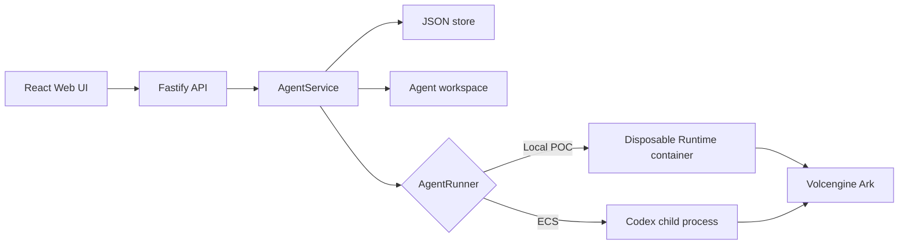

# Architecture

Volc Agent Launchpad is a single-node control plane for hackathon use.



## Components

### Web UI

Lists Agents, manages lifecycle actions, submits prompts, and polls asynchronous
Runs. It never receives the Ark API key.

### Fastify API

Validates requests, protects remote demos with a shared bearer token, and
serves the compiled Web UI. The token is not user identity or authorization.

### AgentService

Coordinates lifecycle state, persistence, workspaces, and Runs. One Agent can
have only one active Run.

```text
ready -> busy -> ready
  |       |
  v       v
stopped  error
```

Interrupted Runs become `cancelled` after a restart.

### Storage

```text
data/launchpad.json       Agent, message, and Run metadata
workspaces/AgentID/       Agent-created files
workspaces/.deleted/      Archived deleted workspaces
codex-home/               Codex configuration and sessions
```

`JsonStore` serializes writes and atomically replaces one JSON file. It supports
one process only.

### Runtime providers

- `CodexRunner` runs Codex inside the application container for ECS.
- `ContainerCodexRunner` starts one disposable Docker, Colima, or Podman
  container for every local turn.

Both providers use argv-only process execution, bound output and time, resume
the stored Codex thread, and escalate termination after a grace period.

## Deployment profiles

| Profile | Control plane | Agent execution |
| --- | --- | --- |
| Local POC | Host Node.js | Disposable local container |
| ECS | Application container | Codex process in the same container |
| Local development | Host Node.js | Host Codex process |

## Extension seams

| Track | Primary seam | Expected change |
| --- | --- | --- |
| Glass Box | `AgentRunner`, `AgentRun` | Emit and display correlated execution events. |
| Bouncer | API routes, Agent ownership | Add identity and server-side authorization. |
| Kill Switch | `AgentRunner` | Add threat-specific policy or a stronger sandbox. |

The current container or ECS instance is the POC trust boundary. Ordinary
containers are not hardened multi-tenant isolation.

# Task-server boundary

The task-server is a private protocol service, separate from the frontend
HTTP app. `Router` is the seam between agent transports and task coordination:
agents register a channel during initialization, agent messages are validated
against the router schemas, and coordinator results are validated again before
they are returned or dispatched to an agent.

`createTaskServerApp` exposes only `/health` and authenticated `/messages`; it
does not register CORS, static files, or frontend routes. The eventual process
initializer should construct the coordinator, construct `Router` with the
coordinator, register each initialized agent, and listen on a private host or
network interface. The frontend uses `APP_AUTH_TOKEN`; agent traffic uses the
separate `TASK_SERVER_AUTH_TOKEN`. Successful `done` requests receive a JSON
acknowledgement for compatibility with `agentctl`. A WebSocket/SSE adapter can use
`Router.dispatch` without changing the coordinator or protocol schemas.

An `agentctl` client can send a message like this:

```sh
TASK_SERVER_URL=http://127.0.0.1:4000 \\
TASK_SERVER_AUTH_TOKEN="$TASK_SERVER_AUTH_TOKEN" \\
AGENT_ID=agent-1 \\
node - <<'NODE'
const response = await fetch(`${process.env.TASK_SERVER_URL}/messages`, {
  method: "POST",
  headers: {
    "content-type": "application/json",
    authorization: `Bearer ${process.env.TASK_SERVER_AUTH_TOKEN}`,
  },
  body: JSON.stringify({
    msg_id: crypto.randomUUID(),
    agent: process.env.AGENT_ID,
    task_id: null,
    body: { kind: "fetch", paths: ["src/App.tsx", "src/api.ts"] },
  }),
});
console.log(response.status, await response.text());
NODE
```
